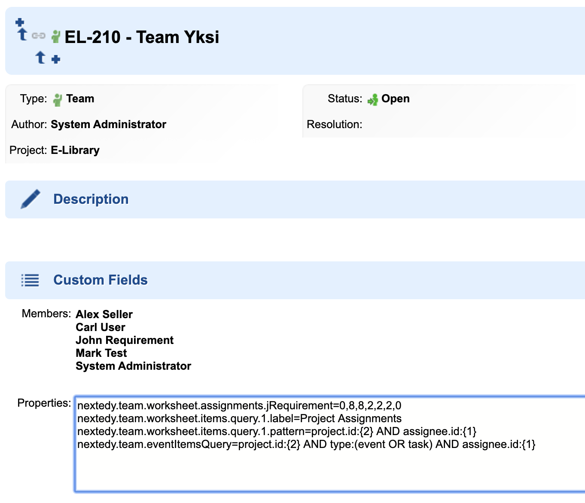

# Configuration Properties
You can define following properties in **Administration > Configuration Properties** or at the team level using **Team Item > Properties**

TODO: describe better

* ("nextedy.team.key.members","members");
* ("nextedy.team.default.allocation", null);
* ("nextedy.team.default.event.allocation", "0");
* ("nextedy.team.default.itemsQuery.label", "Team Assignments");
* ("nextedy.team.default.itemsQuery.pattern", "assignee.id:{1}");
* ("nextedy.team.workRecordsItemsQuery", "project.id:{1}");
* ("nextedy.team.eventItemsQuery", "project.id:{2} AND type:event AND assignee.id:{1}");
* ("nextedy.team.worksheet.items.query."+i+".label", null);
* ("nextedy.team.worksheet.items.query."+i+".pattern", null);
* ("nextedy.team.worksheet.assignments."+user, null);
* ("nextedy.worksheet.workrecord.defaultType.id", null);
* ("nextedy.worksheet.workrecord.defaultType.label", null);
* ("nextedy.worksheet.workrecord.defaultType.color", "lightblue");
* ("nextedy.worksheet.event.key.startDate", "startDate");
* ("nextedy.worksheet.event.key.endDate", "endDate");
* ("nextedy.worksheet.event.key.allocation", "allocation");
* ("nextedy.check.minOK","0.85");
* ("nextedy.check.maxOK","1.1");
	
