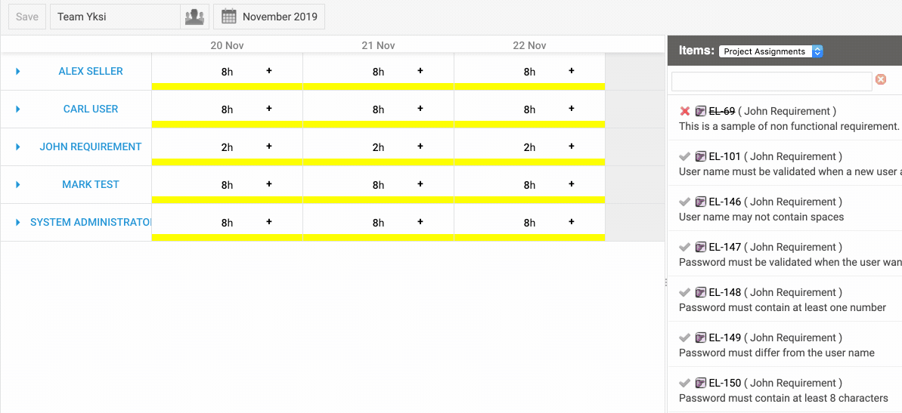

# Nextedy WORKSHEET

**Interactive** Work Tracking and Team Assignments for **Polarion ALM**. 

* *Discover available resources just by browsing the calendar*
* *Maximize team capacity allocations*
* *Create and assign work records with ease for micro-planning or service-time recording*

## Discover available resources

Browse the timeline of your project and access an overview of all the resources in your teams. Instantly spot available or overloaded resources and ensure you deliver projects on time and with maximized effectivity. 

## Maximize team capacity

Check a live breakdown of team allocation in real-time, including the capacity and availability of every engineer. Find out if you are not overloading your team and determine needed capacity at a glance.

## Assign work records with ease

Assign work records to a team. Plan and manage work items in easy to use interactive interface. Team members can also plan their week directly in the Worksheet view.

## How does it work?

### Setup your team

The team item holds the information who works in a team, with what capacity. You can also specify what are the 'Work Items Collections' the team is supposed to work on.

### Manage Records

The solution is using work records for both: to assign (ie. plan) the item to a particular day in a future and to report the work done in a particular day.

The Work Records types are used to differentiate e.g. between billable and non-billable time

