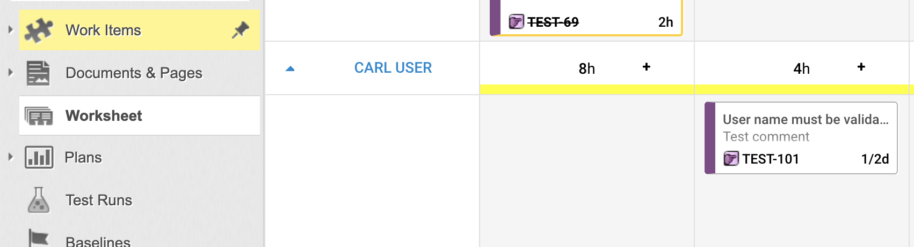
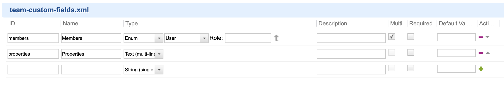

# Setup

## Install Plugin (on server)
	
1.  Download the latest distribution from [here](../download)
6.  Stop Polarion service
3.  Unzip `worksheet.zip`
4.  Copy `com.nextedy.polarion.worksheet` folder into `[POLARION_INSTALL]/polarion/extension` folder.
4.  If you already have production license, please copy the `worksheet_lic.json` file to `[POLARION_INSTALL]/polarion/license`
6.  **Delete `[POLARION_INSTALL]/data/workspace/.config`**
7.  Start Polarion service

!!! warning
    Please, do not forget about step 6.


## Install Demo Project (using browser)


1. Download the latest distribution from [here](../download) also to your local PC and unzip it.
2. Open Polarion with your browser and navigate to: `Repository Administration > Project Templates`
3. Click on `Upload` in toolbar
4. Select `com.nextedy.polarion.worksheet/template/elibrary_worksheet_template.zip`
5. Create a new project from template "Worksheet Demo"
6. Open your new  project
7. You will find "Worksheet" topic there




## Configure Existing Project

### Add Worksheet Navigation Entry

1. Go to `Project Administration > Portal > Topics`
2. Select `Default` view
2. Add there: 
```
    <topic id="worksheet"/>
```

### Setup Team Work Item Type

1. Go to `Project Administration > Work Items > Types`
2. Setup a new work item type with ID "team"
3. Setup custom fields for the Team work item, i.e. go to `Project Administration > Work Items > Custom Fields`
4. Crete new configuration for type  `Team`
5. Add **multi-valued** custom field `members` of type `Enum:User`
6. Add custom field `properties` of type `Text (multi line)`


!!! Info
	If you want to use other work items than those with type.id `team`, or if you want to load the team items from other than current projecty, use following context property to override the default:
	
	```
	nextedy.team.query=project.id:{0} AND type:team
	```
	
	You can also change the name of the `properties` custom field by context property:
	
	```
	nextedy.team.key.properties=properties
	```


	

### Add Team Items

1. Go to `Project > Work Items > Team`
2. Create your teams by creating item of type "team"
3. Select team members by using custom field "members"
4. Optionally setup team properties, e.g.

```
nextedy.team.worksheet.assignments.rProject=0,8,8,2,2,2,0
nextedy.team.worksheet.items.query.1.label=Unresolved Team Tasks
nextedy.team.worksheet.items.query.1.pattern=assignee.id:{1} AND NOT HAS_VALUE:resolution
nextedy.team.worksheet.items.query.2.label=Resolved Team Tasks
nextedy.team.worksheet.items.query.2.pattern=assignee.id:{1} AND  HAS_VALUE:resolution
nextedy.team.workRecordsItemsQuery=type:task
nextedy.team.eventItemsQuery=project.id:{2} AND type:(event) AND assignee.id:{1}
```


### Config Properties

There are many configuration properties to fine tune the settings, check [Config Properties Page](../config-properties)


<hr>
<iframe src="https://nextedy.github.io/worksheet/download/bnum.txt" height=35 style="padding-top:10px;border:0px solid white;"> </iframe>
